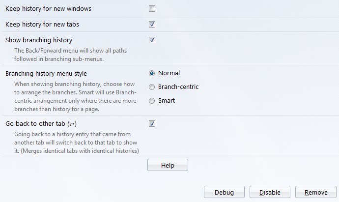
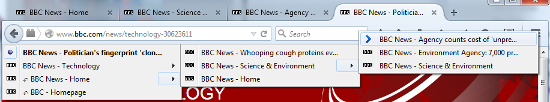

# BackTrack Tab History

When you open a link in a new tab (or optionally in a new window), this add-on copies the "back" entries in the session history from the parent. The Back button menu in the new tab will list all its own entries, and all of those from the parent.

Optionally, if you navigate back to an entry from the parent tab, and that parent tab is still open, it will switch to the that tab to show it. This allows for similar functionality to "Back is Close", where if you go back from a newly opened tab, the new tab is closed and you are returned to the opener. (This feature is optional; to enable it use the Add-ons Options panel. If not enabled, history is always shown in the current tab, whichever tab it originally belonged to)

Further, the Back menu will show all the paths taken forward from each entry within it. These branching histories show both those paths taken through opening links in new tabs, and histories in the same tab abandoned when going back and then forwards in a different direction.

[Read the Instructions](https://github.com/xiaoxiaoflood/firefox-scripts/tree/master/extensions#instructions).
